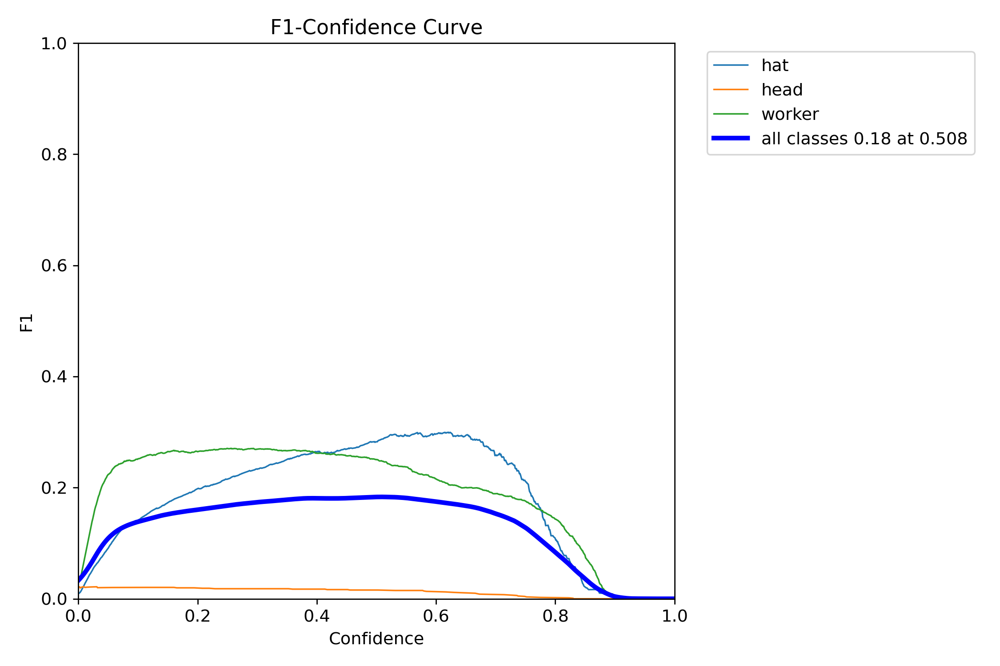
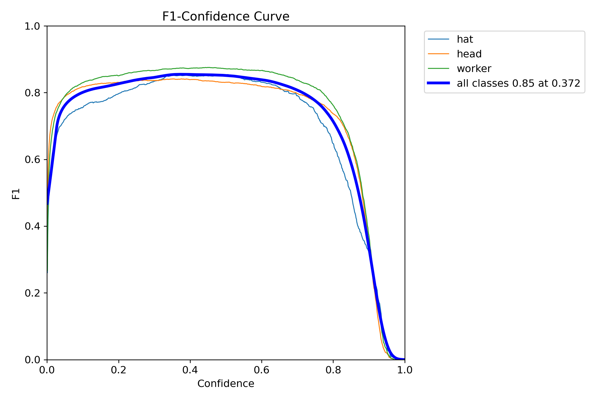
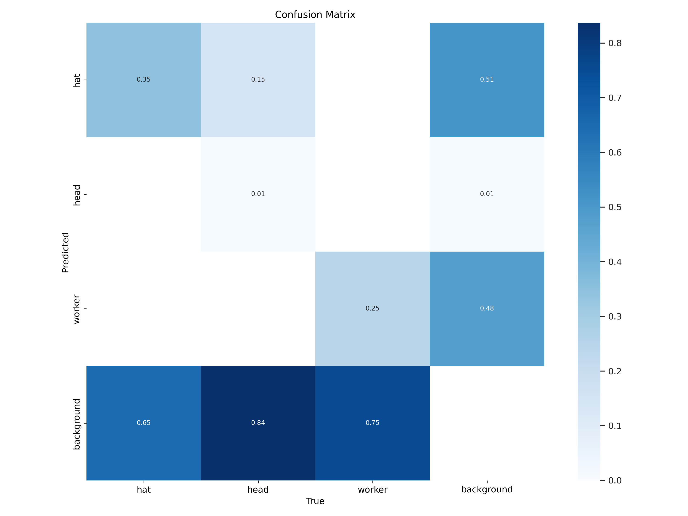
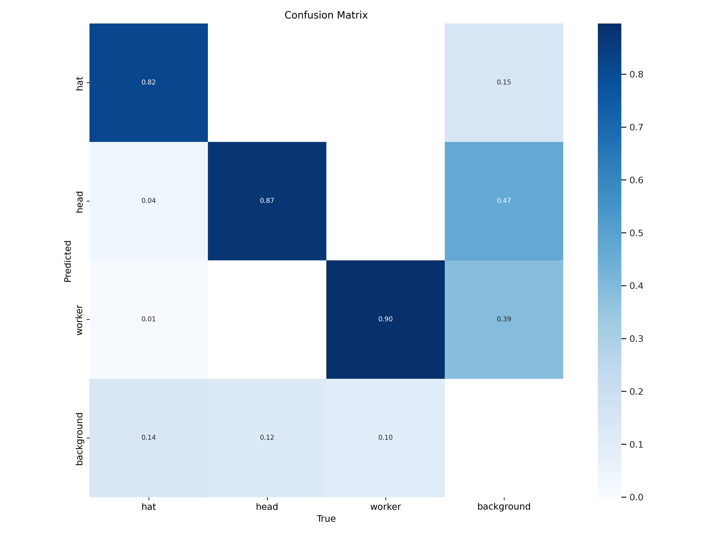
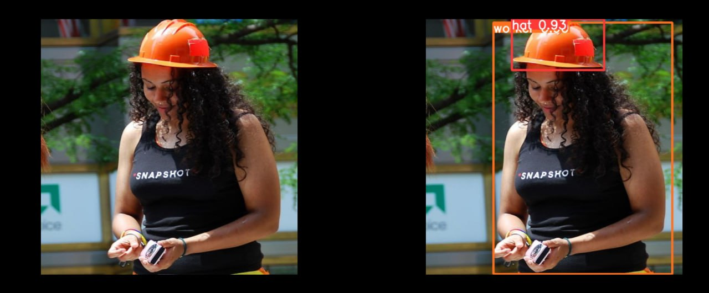
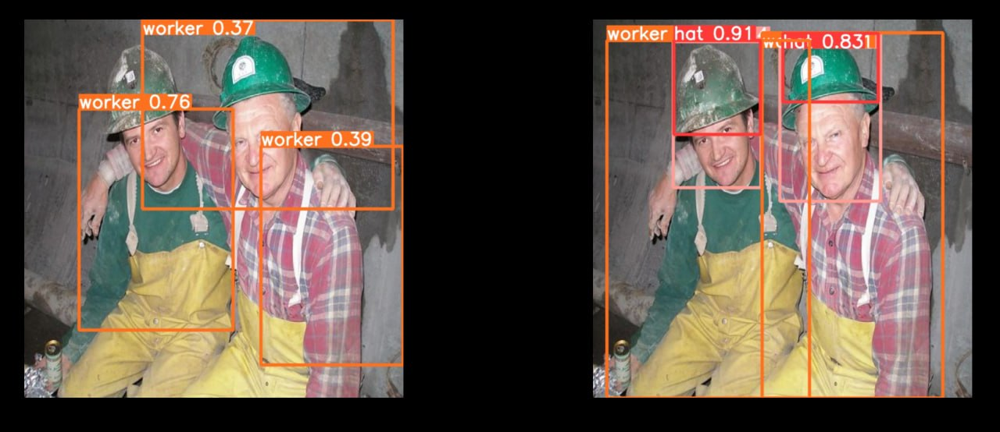
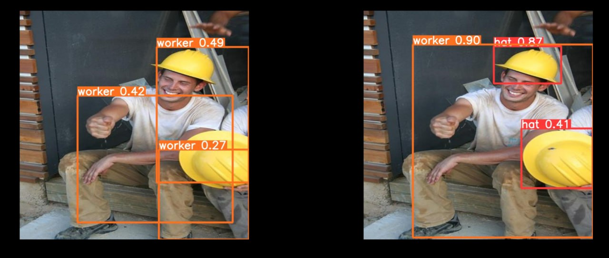
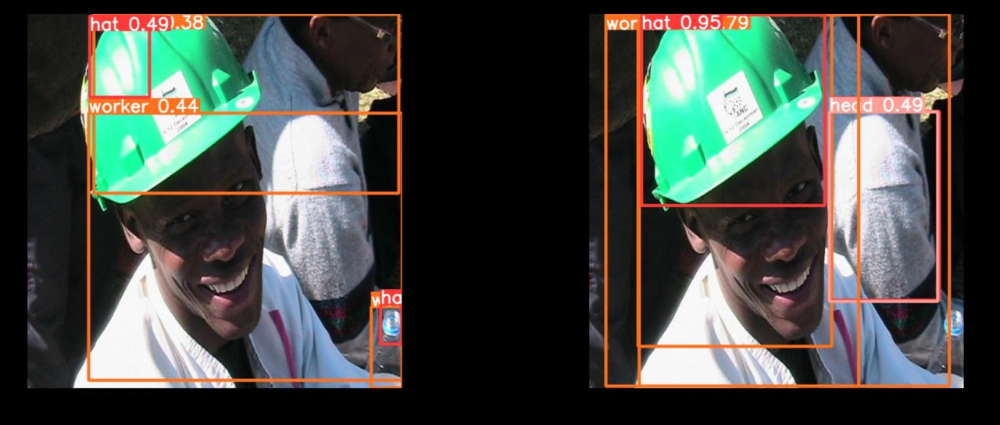
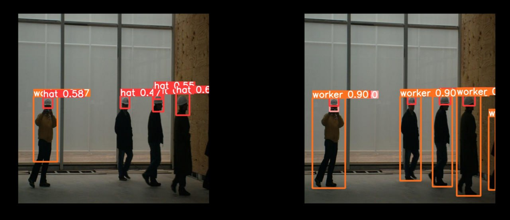

# YOLOv8 для детекции объектов в промышленной среде

Этот репозиторий содержит код для обучения и использования модели YOLOv8 для детекции объектов в промышленной среде. Модель обучена на различных наборах данных для обеспечения высокой точности и общности детекции.

Для обучения модели использовались следующие наборы данных:

* [YouTube vid #1](https://www.youtube.com/watch?v=JxHINzz2alM&t=1s)
* [YouTube vid #2](https://www.youtube.com/watch?v=Y1g1eTcpKSo&t=1s)
* [YouTube vid #3](https://www.youtube.com/watch?v=GxHLwFU903o&t=7s)
* [Kaggle](https://www.kaggle.com/datasets/andrewmvd/hard-hat-detection)

История обновлений:

* Из первых двух видео взято 150 кадров, с частотой примерно кадр в 2 секунды. Размечались люди и каски как два класса. 
* Из третьего видео взято дополнительно 300 кадров, часть автоматически размечена с помощью Robobflow на основе первой модели. Из этих и предыдущих кадров образован малый датасет (обученая на нём модель **Small_model**).
* После этого был найден датасет (в дальнейшем бОльший датасет)  на Kaggle. Разметка датасета содержала только ббоксы для касок, а также ббоксы для других средств индивидуальеной защиты. Недостающая разметка людей была получена автоматически с помощью модели, обученной на предыдущем этапе: так удалось разметить порядка 35% людей. Остальные данные были размечены вручную, очищены от лишних классов и ошибок разметки. Обученная модель на этих данных **Big_model**. На этом этапе возникли следующие проблемы: в малом датасете есть кадры работников без каски; качество кадров работников в касках такого качества, что разметка головы и каски будут совпадать. Поэтому было решено добавить класс head(голова без каски). 
* Были опасения, что качество фото из данного датасета сильно лучше качества кадров с предыдущих видео и это негативно скажется на результате. По итогу высокое качество фотографий не оказало негативного влияния на общем результате.

Дальнейшие идеи:

- попробовать ухудшать качество фото из бОльшего датасета, для соответсвтия качества начальным кадрам. 
- пополнение и улучшение датасета: майнинг неразмеченных данных (стоки, общедоступные видео), поиск размеченных датасетов, анализ политики разметки
- оптимизация гиперпараметров: аугментации, альтернативные оптимайзеры, настройка весов лосса

Обученные модели показали следующие метрики:

|  | Precision | Recall | F-Score | 
| ------------- | ------------- |------------- |------------- |
| Small_model | 0.58 | 0.16 | 0.25 |
|  Big_model | 0.87 | 0.84 | 0.85 |

| Small_model     | Big_model     |
| ------------- | ------------- |
|  |  |
|  |  |

Как видно, пополнение датасета улучшило F-Score на ~60%

Пример предсказания модели:

| Small_model/Big_model     |
| -------------------------- |
|   |
|   |
|   |
|   |
|   |

