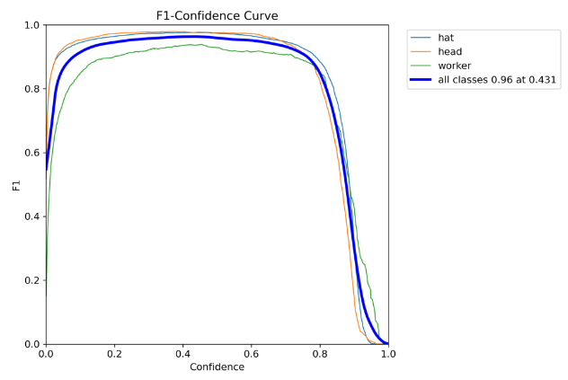
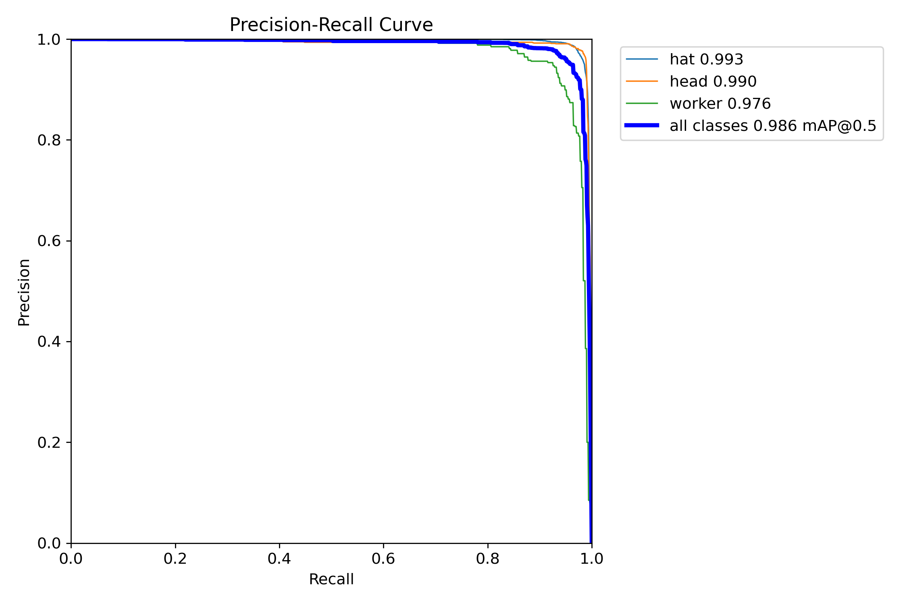
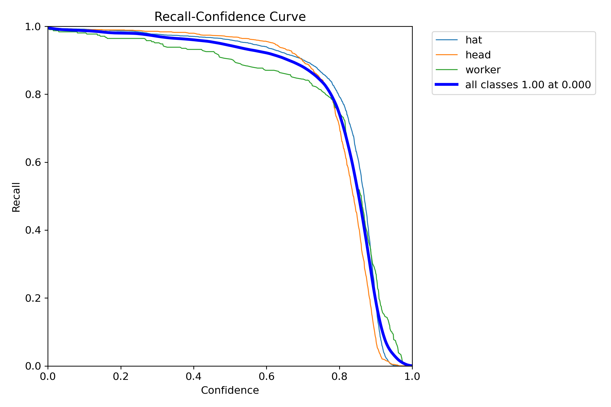
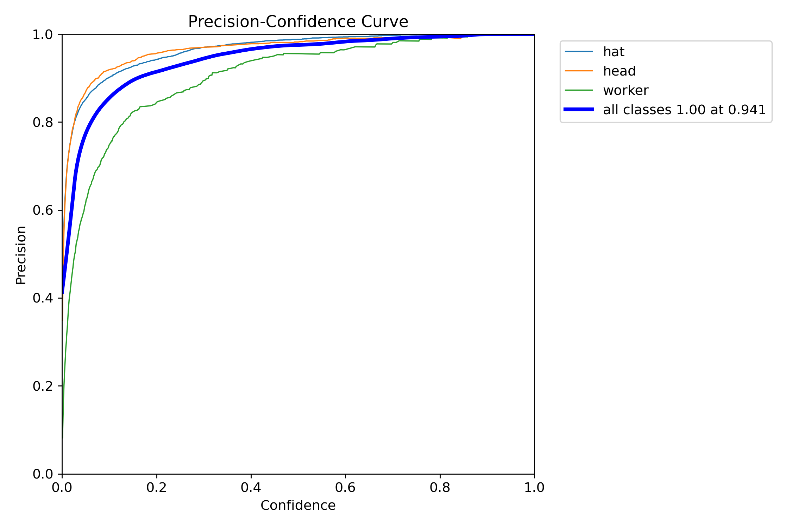
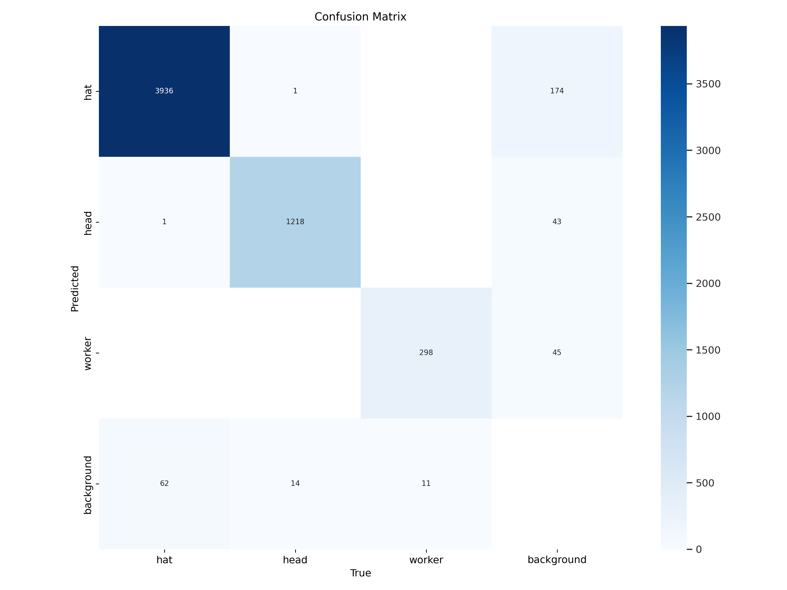
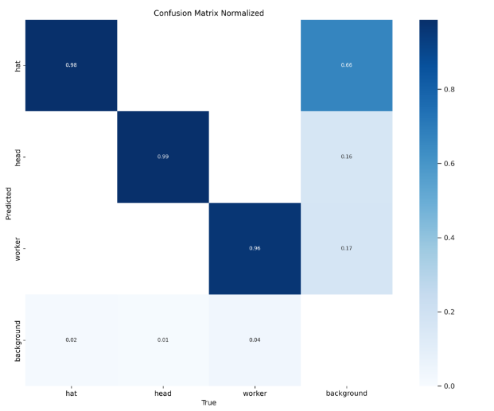

# YOLOv8 для детекции объектов в промышленной среде

Этот репозиторий содержит код для обучения и использования модели YOLOv8 для детекции объектов в промышленной среде. Модель обучена на различных наборах данных для обеспечения высокой точности и общности детекции.

Для обучения модели использовались следующие наборы данных:

Набор данных #1 * [YouTube vid #1](https://www.youtube.com/watch?v=JxHINzz2alM&t=1s) + [YouTube vid #2](https://www.youtube.com/watch?v=Y1g1eTcpKSo&t=1s)
* предыдущий датасет + [YouTube](https://www.youtube.com/watch?v=GxHLwFU903o&t=7s) 
* предыдущий датасет + [Kaggle](https://www.kaggle.com/datasets/andrewmvd/hard-hat-detection)

История обновлений

Версия 1: Модель была обучена на 150 изображениях.
Версия 2: Улучшенная модель была обучена на 450 изображениях.
Текущая версия: Модель обучена на крупномасштабном наборе данных из 5000 изображений.

Пример предсказания модели:

Predict первой версии: [result 1](https://drive.google.com/file/d/1xwsO57o0WsZ6MUl9PymYGZDIpfv56Z1v/view?usp=sharing)
Predict второй версии: [result 2](https://drive.google.com/file/d/1cTyRh7RDxs5lxTDHKRfMq0KuPth1hHxk/view?usp=sharing)
Сравнение первой и второй версий [comparison](https://drive.google.com/file/d/1bq2xsndV-H62lCvBp8B3ZhaAaID785DF/view?usp=sharing)
Predict третьей версии: [result3](https://drive.google.com/file/d/1txo49_ihh9pyMkmLjqDl1roWpvvFRLKl/view?usp=sharing)

После обучения текущей модели были получены следующие метрики качества:

| -------------     | -------------     |
|  |  |
| ------------- | ------------- |
|  |  |
| ------------- | ------------- |
|  |  |

Результаты и будущие планы

Модель YOLOv8 показывает высокую точность и обнаруживает объекты в промышленной среде с высокой надежностью. 
Дальнейшие планы включают в себя: 
- пополнение и улучшение датасета: майнинг неразмеченных данных (стоки, общедоступные видео), поиск размеченных датасетов, анализ политики разметки
- оптимизация гиперпараметров: аугментации, альтернативные оптимайзеры, настройка весов лосса
